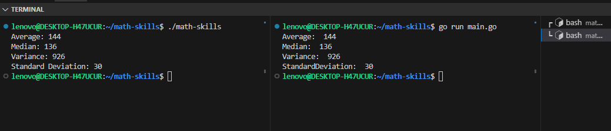

# Math Skills
The purpose of this project is for you to calculate the following:

- Average
- Median
- Variance
- Standard Deviation

## Project Overview
- your turn is to run ./math-skills file it will generate numbers in data.txt
- The program then read from a file data.txt and print the result of each statistic method.

## Installation
- if math-skills program file not found dowanlod math-skills program file from audits for this project and place it on the roor diractory
- Grant Permission for math-skills file
```bash
~/math-skills$ chmod +x math-skills
```

## Usage
- Open Terminal and place this code:
```bash
~/math-skills$ ./math-skills
``` 
- Open another Terminal on the side and place this code:
```bash
~/math-skills$ go run main.go
``` 

-Take your Time and compare 😊
